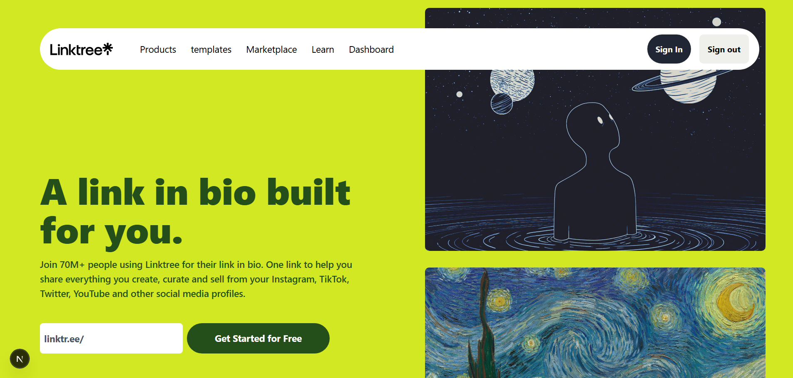

# 🌳 LinkTree Clone

A high-performance, clean "Link-in-Bio" platform built to centralize your digital identity. This isn't just a list of buttons; it's a deep dive into modern UI patterns and secure authentication.

## 🚀 Demo


[📺 Watch the Video Demo here](https://youtu.be/xySmn5WAae4)

---

## 🛠 Tech Stack
| Frontend | Backend / Auth |
| :--- | :--- |
| React/Next.js | NextAuth.js |  
| Tailwind | Google Cloud Console |  
| react-toastify | mongodb |

---

## ✨ Key Features & Technical Wins

I didn't just build a clone; I used this project to learn and understand about the complex frontend behaviors and backend security.

### 🎨 Frontend technique's
*   **Dynamic Carousels:** build both **vertical and horizontal sliders** for sleek content discovery without cluttering the viewport.
*   **Intelligent Navigation:** Implemented a "Smart Nav" that detects scroll velocity. It hides during fast downward scrolls to maximize screen real estate and reappears instantly when you scroll up.
*   **Floating Menus:** A modern, decoupled navbar with a floating action menu for a better desktop experience.
*   **Media Integration:** Integrated **optimized video animations** to create a high-energy, interactive atmosphere.

### 🔐 Backend & Security
*   **Google Provider Auth:** Implemented secure, industry-standard authentication using Google OAuth. Users can log in safely without me having to manage their passwords.

---

## ⚙️ Installation & Setup

1. **Clone the repo**
   ```bash
   git clone [https://github.com/Abhishek-Dubey-akdy/Link_tree_clone.git](https://github.com/Abhishek-Dubey-akdy/Link_tree_clone.git)

   cd Link_tree_clone
   ```
